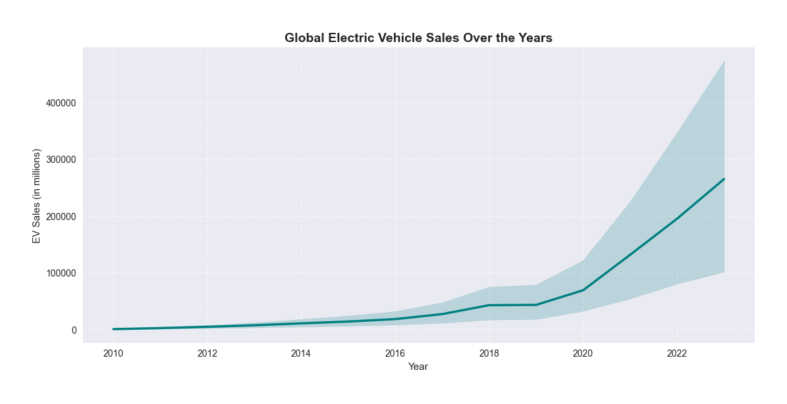
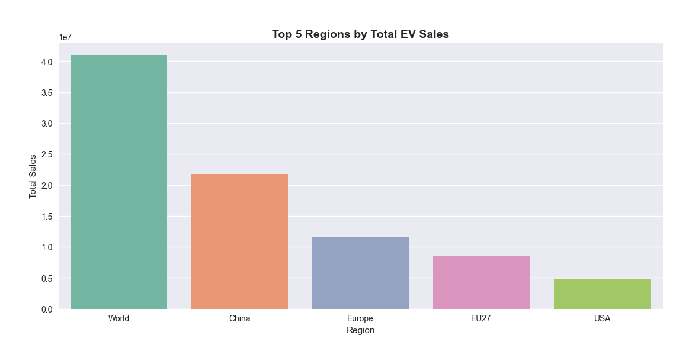
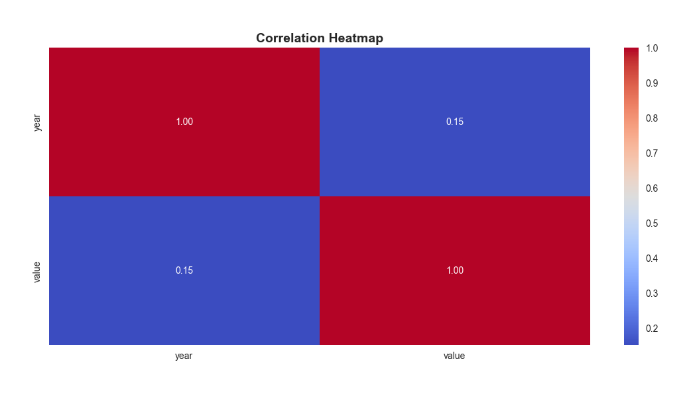
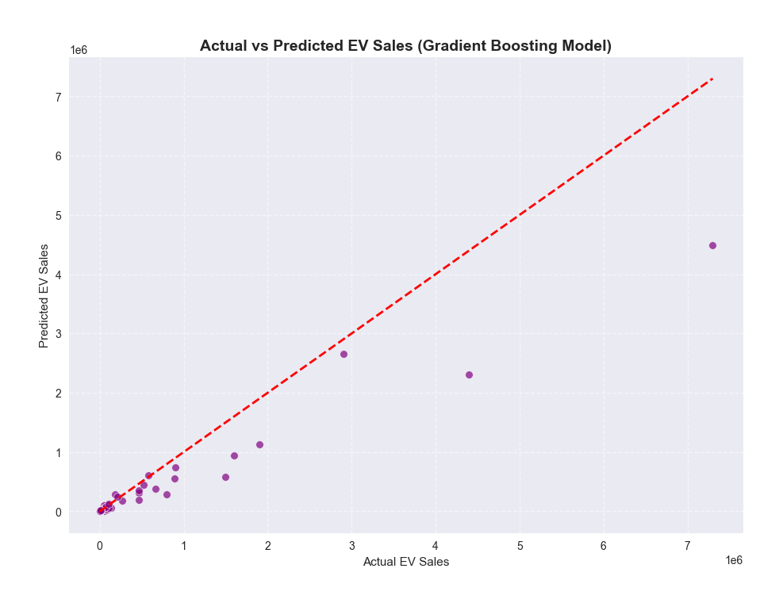

# 🚗 Electric Vehicle (EV) Sales Prediction

### 📘 Overview
This project is developed as part of the **AICTE – EduNet Internship (Electric Vehicle Theme)**.  
It focuses on **analyzing and predicting global Electric Vehicle (EV) sales trends** using **data visualization and machine learning** techniques.

The goal is to understand EV adoption patterns across different regions and forecast future growth trends using real-world EV sales data.

---

## 📊 Project Highlights
- **Dataset:** Global EV sales data (2010–2023)  
- **Tech Stack:** Python, Pandas, Seaborn, Matplotlib, Scikit-Learn  
- **Notebook Used:** `week1_ev_sales_prediction.ipynb`  
- **Outputs Generated:**
  - 📈 Global EV Sales Trend  
  - 🌍 Top 5 Regions by EV Sales  
  - 🔥 Correlation Heatmap  
  - 🤖 Advanced Machine Learning Model (Gradient Boosting)

---

## 🧹 Data Cleaning
Before performing analysis, the dataset was cleaned and filtered for relevant records.

**Steps performed:**
1. Filtered only EV sales data (`parameter == "EV sales"`)
2. Selected key columns: `region`, `year`, and `value`
3. Converted data types to numeric and dropped missing values
4. Verified the cleaned dataset → **(1342 rows × 3 columns)**

---

## 📈 Exploratory Data Analysis (EDA)

### 1️⃣ Global EV Sales Over the Years
Visualizes how EV sales have evolved globally over the years.

---

### 2️⃣ Top 5 Regions by Total EV Sales
Highlights the top-performing regions based on total EV sales.

---

### 3️⃣ Correlation Heatmap
Shows the correlation between numerical features in the dataset.

---

## 🤖 Machine Learning Model (Week 2)

### ✅ Model Used: Gradient Boosting Regressor
To predict global EV sales based on year, region, category, mode, and powertrain.

**Key steps:**
- Encoded categorical features (`region`, `mode`, `powertrain`, `category`)
- Added polynomial features to capture non-linear trends
- Applied log transformation on target (`value`) for stability
- Used **Gradient Boosting Regressor** for accurate predictions

---

### 📊 Model Performance

| Metric | Value |
|:--------|:--------|
| **R² Score (Accuracy)** | **83.63%** |
| **MAE** | 39,014.87 |
| **RMSE** | 234,987.92 |

---

### 🔮 Prediction Visualization
Displays how close the predicted EV sales values are to the actual sales.

---

## 🧠 Key Insights
- EV sales have shown **exponential growth after 2015**, driven by technological innovation and policy support.  
- **China, Europe, and the United States** lead the EV market globally.  
- The **machine learning model (83.6% accuracy)** effectively predicts EV sales trends.  
- The growth pattern suggests continued acceleration in global EV adoption.

---

## 🏁 Future Scope
- 🧮 Implement time-series forecasting models (ARIMA, LSTM) for future EV sales prediction  
- 📊 Develop an interactive dashboard for real-time visualization  
- ⚡ Expand analysis to include **charging infrastructure and emission reduction data**

---

## 🧰 Tools & Libraries Used
| Category | Libraries |
|-----------|------------|
| **Data Handling** | Pandas, NumPy |
| **Visualization** | Matplotlib, Seaborn |
| **Machine Learning** | Scikit-learn (Gradient Boosting, Preprocessing) |
| **Environment** | Jupyter Notebook |

---

## 👩‍💻 Author
**Shreya V**  
B.E. Computer Science and Engineering (Cybersecurity)  
Sri Krishna College of Technology, Coimbatore  

🔗 [GitHub Profile](https://github.com/Shreyavenkatakumar)

---

⭐ *If you found this project helpful or inspiring, please give it a star on GitHub!* 🌟

